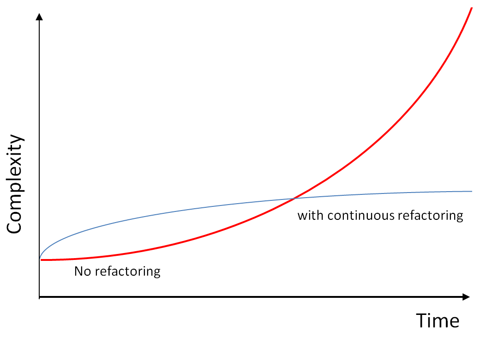
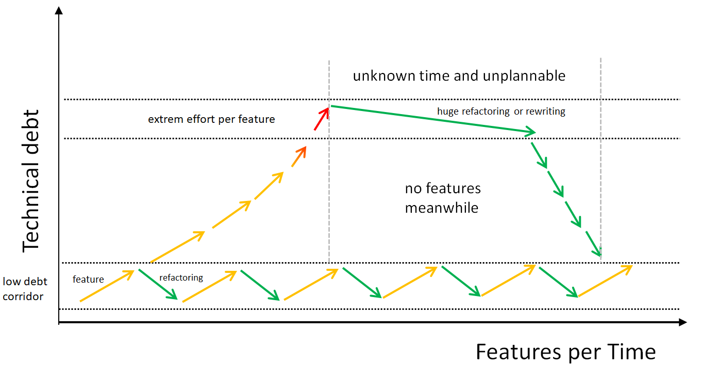

# Prinzipien des Refactoring

## Einleitung {#einleitung}

In diesem Dokument werden allgemeine Prinzipien für das Refactoring von Code beschrieben.
Diese Prinzipien sind unabhängig von der Programmiersprache und können auf jede Sprache angewendet werden.

Spezifische Regeln zu Code-Refactoring für alle Programmiersprachen finden sing in [Allgemeine Regeln](./all) und für spezifische Sprachen in den entsprechenden Kapiteln.

Allen Kapiteln wurde eine eindeutige Nummerierung, der Richtliniennummer, hinzugefügt, um eine eindeutige Identifikation zu ermöglichen.
Jede Richtliniennummer besteht aus dem Buchstaben **RFG**(Refactoring General) gefolgt von einer Nummer, die den Abschnitt identifiziert.
Damit kann eine Regel eindeutig identifiziert werden, z.B. für ein Code-Review.

## RFP1 Begriffsdefinition {#begriffsdefinition}

`Refactoring` ist ein Prozess, bei dem der Code verbessert wird, ohne das Verhalten zu ändern. Es ist ein wichtiger Bestandteil der Softwareentwicklung, um die Wartbarkeit und Lesbarkeit des Codes zu verbessern.
Durch Refactoring wird die sogenannte **technische Schuld** abgebaut, die durch schnelle Lösungen und Kompromisse entsteht.

::: warning Integrierter Bestandteil der Programmierung
Code Refactoring ist als integraler Bestandteil der normalen Programmiertätigkeit zu betrachten.
:::

`Code Refactoring` bezieht sich auf den Prozess der Überarbeitung von vorhandenem Code, um dessen interne Struktur zu verbessern, ohne dabei das externe Verhalten zu ändern.

Das Hauptziel des Refactorings besteht darin, den Code lesbarer, verständlicher und leichter wartbar zu machen.
Es beinhaltet das Umstrukturieren des Codes, um ihn effizienter, besser organisiert und robuster zu gestalten.
Dabei werden Code-Duplikate entfernt, komplexe Teile vereinfacht, Code-Standards angepasst und die Code-Qualität verbessert.

::: warning
Es ist wichtig zu beachten, dass Refactoring kein Zwang ist, sondern eine empfohlene Praxis, um die Qualität des Codes im Laufe der Zeit kontinuierlich zu verbessern.
Viele Entwickler haben jedoch Angst vor Refactoring, da sie befürchten, dass es zu unerwünschten Seiteneffekten führen könnte und ihr Manager ihnen keine Zeit dafür gibt.
Trotzdem merken sie irgendwann, dass der Code so unübersichtlich und komplex geworden ist, dass er Schmerzen verursacht, ihn zu ändern.
:::

<!-- !glossary-->
::: details Refactoring vs. Refaktorisierung

- **Refactoring** ist der Prozess, bei dem der Code verbessert wird, ohne das Verhalten zu ändern.
- **Refaktorisierung** ist die Tätigkeit, die während des Refactorings durchgeführt wird.

:::

## RFP2 Warum Refactoring? {#warum-refactoring}

Kein Entwickler oder Entwicklerin schreibt von Anfang an Code, der perfekt ist.

{width=70%}
Veränderung der Komplexität mit und ohne Refactoring

- Ein häufiger Grund, warum Code so ist wie er ist, ist, dass ein Feature zu einem bestimmten Zeitpunkt versprochen und geliefert werden musste.
**Überstürzte Fristen** führen zu Code, der nicht erweiterbar, wartbar, verständlich ist und nicht automatisch getestet werden kann.
Zusätzlich müssen weitere Features schnellst möglichst hinzugefügt werden, was die Situation verschlimmert, denn Zeit für einer Verbesserung von Code ist auch nicht vorhanden.
- Ein weiterer Grund ist, dass Entwickler oder Entwicklerinnen nicht immer das **nötige Wissen oder die Fähigkeiten** haben, um den Code besser zu schreiben.
Dadurch entstehen Lösungen im Code, die alles andere als ideal ist und trägt weiter zur technischen Schuld bei.
- Nichts ist so beständig wie der Wandel und **jede Anforderung kann sich ändern**.
Das führt zu zweckmäßigen Lösungen, die oft mit der sprichwörtlichen heißen Nadel gestrickt sind.
Selbst eine einst mal so geplante Architektur kann nicht jeden Umstand berücksichtigen und stellt sich mit ändernden Anforderungen als unzureichend heraus.
Trotzdem wird versucht, die Anforderungen in den bestehenden Code zu quetschen.
- Jede **Entscheidung**, die getroffen wird, musste abwiegen zwischen verschiedenen **Kompromissen**.
Nach einer Zeit kann sich so ein Kompromiss als falsch herausstellen und folglich muss eine Anpassung vorgenommen werden, um die Fehlentscheidung zu korrigieren.
- Oftmals besteht bereits eine **lange existierende Codebasis**, die über Jahre gewachsen ist und von vielen Entwicklern bearbeitet wurde.
Die Strukturen und Muster sind veraltet und nicht mehr klar erkennbar, so dass es schwer fällt, den Code zu verstehen und zu erweitern.
- Und zuletzt wird ein Refactoring oft verschoben, weil es **keine Zeit** dafür gibt oder es **nicht als notwendig** erachtet wird.
Auch sogenannte **Refactoring-Tickets** werden oft nicht priorisiert, weil sie keine neuen Features liefern.

> Code altert nicht, er wird alt.

Aus diesen genannten Gründen manifestieren sich unterschiedliche **technische Schulden** im Code:

- Code wird **unübersichtlich** und **verworren**.
Damit brauchen Entwickler und Entwicklerinnen immer länger, um den Code zu verstehen und zu warten.
- Sogenannte **Code Smells** treten auf, die auf tiefer liegende Probleme hinweisen wie überlange Funktionen, verschachtelte Schleifen, globale Variablen und duplizierter Code.
- **Dokumentation ist nicht mehr aktuell** und **Kommentare veraltet** oder geben falsche Informationen wieder.
- **Tests sind nicht vorhanden** oder die Test-Abdeckung ist gering, so dass Änderungen am Code nicht sicher durchgeführt werden können.
- Wenn ein Teil des Codes verändert wird, kann es zu **unerwarteten Seiteneffekten** an anderen Stellen kommen, denn der Code ist stark miteinander **gekoppelt**.
- Die Architektur kann nicht mehr den Anforderungen gerecht werden und **neue Features** können nur schwer hinzugefügt werden.

{width=90%}
*Technische Schuld mit und ohne Refactoring*

**Die Entwicklung eines Produkts ist ein Lernprozess.**

Der Abbau dieser technischen Schulden ist daher ein **wichtiger Bestandteil** der Softwareentwicklung, um all die genannten Probleme zu beheben und mittel- und langfristig neue Features in das Produkt integrieren zu können.

::: info Kurz gesagt

- Refactoring verbessert das Design des Codes, ohne das Verhalten zu ändern, damit Features auch weiterhin funktionieren.
- Refactoring macht den Code lesbarer, verständlicher und leichter wartbar, damit neue Features einfacher integriert werden können.
- Refactoring baut technische Schulden ab und verbessert die Code-Qualität, damit neue Features einfacher integriert werden können.
- Refactoring hilft den Code zu verstehen, damit ein neues Feature einfacher integriert werden kann.
- Refactoring hilft beim Finden und Beheben von Fehlern, damit ein Feature wie gewollt funktioniert.
- **Refactoring hilft vorhandene Features zu korrigieren, verändern und zu erweitern sowie schneller neue Features hinzuzufügen.**

:::

{width=50%}
*Veränderung der Anzahl von Features und Fehlern mit der Zeit ohne Tests und Refactoring*

## RFP3 Wann kann refaktorisiert werden? {#wann-kann-refaktorisiert-werden}

Refaktorisierung kann nur dann richtig durchgeführt werden, wenn Tests vorhanden sind, die das Verhalten des Codes sicherstellen.
Ohne Tests ist es schwierig, sicherzustellen, dass das Verhalten des Codes nach dem Refactoring unverändert bleibt.

## RFP4 Wann sollte nicht refaktorisiert werden? {#wann-sollte-nicht-refaktorisiert-werden}

Refactoring sollte nicht durchgeführt werden:

1. Wenn es keine Tests gibt, kann das korrekte Verhalten des Codes nicht sichergestellt werden.
2. Wenn es keine klare Vorstellung davon gibt, wie der Code verbessert werden kann.
3. Wenn die eigentliche Änderung sehr klein ist und das Refactoring mehr Zeit in Anspruch nimmt.

## RFP5 Was soll nicht von einer Refaktorisierung abhalten? {#was-soll-nicht-von-einer-refaktorisierung-abhalten}

1. Schwer verständlicher Coder muss zuerst versanden werden. Dies kann durch Tests geschehen, die dazu auch das Verhalten des Codes sicherstellen.
2. Schlecht strukturierter Code.
3. Fehlende Zeit für Refactoring.
4. Angst vor Seiteneffekten.
5. Angst vor dem Management, dass keine Zeit für Refactoring zur Verfügung gestellt wird.
6. Angst vor dem Verlust oder der Veränderung des Verhaltens des Codes.

## RFP6 Wann soll refaktorisiert werden? {#wann-soll-refaktorisiert-werden}

1. Refaktorisierung wird vor dem Beginn einer neuen Aufgabe durchgeführt, wenn notwendig.
Die Refaktorisierung ermöglicht es auch sich in den Code einzuarbeiten und den Code dadurch besser zu verstehen.

2. Refaktorisierung wird nach dem Programmieren durchgeführt, um den Code zu verbessern und die Qualität zu erhöhen.

3. Refaktorisierung soll immer dann durchgeführt werden, wenn der Code schwer zu verstehen ist, schwer zu warten ist oder wenn neue Funktionen hinzugefügt werden sollen.

4. Eine Refaktorisierung soll zu einem Bug- oder Story-Ticket durchgeführt werden, und in der Regel nicht als eigenständige Aufgabe.
Ausnahmen können größere Refactorings sein.

5. Die Refaktorisierung soll in kleinen Schritten durchgeführt werden, um die Wahrscheinlichkeit von Fehlern zu minimieren.
Dies erleichtert das Finden und Beheben von Fehlern und hilft, den Überblick zu behalten.
Damit ist es auch möglich große Teile des Codes zu erneuern, ohne dass ein ganzes Team daran arbeiten muss.

6. Zu einer Refaktorisierung gehört zudem das Schreiben von Tests, um die Funktionalität sicherzustellen.

## RFP7 Strangler Pattern {#strangler-pattern}

Ein Refactoring dient dazu, den bestehenden Code in Hinblick auf Lesbarkeit, Wartbarkeit und Effizienz zu verbessern, ohne dabei das Verhalten der Anwendung zu verändern. Dabei wird der Code so angepasst, dass er leichter verständlich und einfacher zu warten ist.

Allerdings ist der zu refaktorisierende Code oft stark mit anderen Teilen der Anwendung verzahnt oder wird von externen Komponenten intensiv genutzt. In solchen Fällen kann es risikoreich sein, den Code direkt umfassend zu ändern, da dadurch unvorhergesehene Probleme entstehen könnten.

Das **Strangler Pattern** ermöglicht es, den bestehenden Code schrittweise zu ersetzen, ohne das bestehende Verhalten der Anwendung zu beeinträchtigen.

Das Strangler Pattern ist eine Technik zur schrittweisen Modernisierung oder Ablösung bestehender Anwendungen. Es funktioniert nach dem Prinzip, dass der alte Code Stück für Stück durch neuen, verbesserten Code ersetzt wird, während der ursprüngliche Code weiterhin parallel existiert.

Der Prozess erfolgt in mehreren Schritten:

1. Der bestehende Code wird als `deprecated` markiert, sodass Entwickler wissen, dass er langfristig ersetzt werden soll.
   Wenn möglich wird er jedoch direkt entfernt, um zu verhindern, dass er weiterhin genutzt wird.
2. Neue Funktionalitäten werden ausschließlich im neuen Code implementiert.
3. Nach und nach werden alte Teile der Anwendung durch den neuen Code ersetzt, bis der alte vollständig entfernt werden kann.

::: info Strangler Pattern Ursprung

Der Name dieses Patterns stammt von der sogenannten "Strangler Fig" (Würgefeige), einem Baum, der einen anderen Baum umschließt und ihn allmählich verdrängt, bis der alte Baum abstirbt und durch den neuen vollständig ersetzt wird.

:::

Das Strangler Pattern eignet sich insbesondere für Legacy-Anwendungen, bei denen ein sofortiger vollständiger Austausch des Codes nicht praktikabel ist.
Durch den schrittweisen Ansatz werden Risiken minimiert und gleichzeitig kontinuierliche Verbesserungen ermöglicht.

Im API-Design können neue Interfaces mit leicht angepasstem Namen verwendet werden, um die alten zu ersetzen.
So können bestehende Clients schrittweise auf die neuen Interfaces migriert werden, ohne dass sie sofort umgestellt werden müssen.

Methoden können schrittweise durch neue umbenannte Methoden ersetzt werden, die das gleiche Verhalten implementieren, aber mit einer verbesserten Struktur und Lesbarkeit.

::: warning Overloading

Overloading beschreibt die Möglichkeit, eine Methode mit dem gleichen Namen, aber unterschiedlichen Parametern zu definieren.
Einige Programmiersprachen unterstützen das Overloading von Methoden, andere nicht.

In manchen Fällen kann es sinnvoll sein, die alten Methoden zu überladen, um die neuen Funktionalitäten zu integrieren.
Es sollte jedoch darauf geachtet werden, dass das Überladen der Methoden nicht dazu führt, dass versehentlich die alten Methoden aufgerufen werden.

:::

REST-Schnittstellen sollten im Pfad bereits eine Versionsnummer enthalten, um zukünftige Änderungen zu ermöglichen, ohne bestehende Clients zu beeinträchtigen.

## RFP8 Prüfung auf Code Smells {#pruefung-auf-code-smells}

`Code Smells` sollen identifiziert und behoben werden, um die Codequalität zu verbessern.

<!-- !glossary-->
::: info Code Smells
Code Smells sind Anzeichen in deinem Code, die auf tiefer liegende Probleme hinweisen können.
Beispiele hierfür sind überlange Funktionen, verschachtelte Schleifen, globale Variablen und duplizierter Code. Durch das Identifizieren dieser "Code Smells" kannst du gezielt Verbesserungen vornehmen.
:::

Siehe [Refactoring-Beispiele](./all).

## RFP9 Vereinfachungen {#vereinfachungen}

Code soll durch Refactoring immer vereinfacht werden, um die Lesbarkeit und Wartbarkeit zu verbessern.

Die Prinzipien [DRY](../2.principles/principles#dry), [SOC](../2.principles/principles#soc) und [KISS](../2.principles/principles#kiss) sind hierbei zu beachten.

## RFP10 Bewusstsein für Seiteneffekte beim Refactoring {#bewusstsein-fuer-seiteneffekte-beim-refactoring}

Während der Refaktorisierung ist es wichtig, sicherzustellen, dass der Code noch immer das tut, was er soll.
Änderungen, die unerwartete Seiteneffekte verursachen könnten, sollen mit Vorsicht behandelt werden.
Es ist daher ratsam, Änderungen in kleinen Schritten durchzuführen und regelmäßig zu testen, um sicherzustellen, dass das Verhalten des Codes unverändert bleibt.

## RFP11 Kein nachträgliches Kommentieren von Code {#kein-nachtraegliches-kommentieren-von-code}

Bestehender Code, der bisher nicht kommentiert wurde, soll im Nachhinein auch nicht kommentiert werden.

Dokumentation von Legacy-Code ist auch im Nachhinein kaum eine Hilfe, den Code zu verstehen.
Beim Lesen von alten Code besteht die Gefahr, dass er falsch verstanden wird und die Dokumentation dadurch nutzlos und verwirrend wird.
Vielmehr soll alter Code selbst im Zuge eines Refactorings verbessert werden, damit er selbsterklärend ist und nur neue Dokumentation braucht.

## RFP12 Code entfernen {#code-entfernen}

Refaktorisierung kann auch das Entfernen von Code bedeuten, der nicht mehr benötigt wird.

Code, der nicht mehr gebraucht wird hat keinen Zweck und kann zu Verwirrung für den Leser führen und benötigt außerdem Zeit, wenn Tests darauf ausgeführt werden.

Wenn der Code und dazugehörige Tests entfernt wurden, soll das Projekt auch neu gebaut werden, um sicherzustellen, dass keine Abhängigkeiten mehr bestehen.

## RFP13 Methodisches Vorgehen {#methodisches-vorgehen}

Ein Refactoring muss methodisch durchgeführt werden, um sicherzustellen, dass das Verhalten des Codes unverändert bleibt.

Ein Vorgehen soll wie folgt aussehen:

1. Sicherstellen, dass ein Test vorhanden ist, der das Verhalten des Codes sicherstellt.
Ggf. einen Test schreiben, wenn noch keiner vorhanden ist.
2. Refactoring in kleinen Schritten mit Zwischenprüfung(en) durchführen, ob der Test noch grün ist.
3. Prüfen, ob alle Tests noch grün sind, damit mögliche Seiteneffekte erkannt werden.

## RFP14 Bezeichner {#bezeichner}

Bezeichner sollen aussagekräftig und verständlich sein, daher ist es wichtig, Namen von Variablen, Funktionen und Klassen im Zuge eines Refactorings zu überprüfen und ggf. anzupassen.

1. Namen können länger, aber aussagekräftiger sein.
2. Abkürzungen sollen ausgeschrieben werden.
3. Namen sollen entsprechend der Funktion benannt werden.
4. Präfixe (`get`, `set`) und Typ-Suffixe (`varStr`, `iVar`) sollen vermieden werden.
5. Komplexe Namen deuten auf komplexe Funktionen hin und die Funktion sollte refaktorisiert werden.

Weitere Regeln können unter [Bezeichner](../6.languages/naming.html) nachgelesen werden.

## RFP15 Doppelter Code {#doppelter-code}

Mehrfach vorkommender Code reduziert Kopplung (Abhängigkeit) kann aber auch zu Wartbarkeitsproblemen führen,
da Änderungen an mehreren Stellen vorgenommen werden müssen (Eine Stelle vergessen?).

1. Einzelne Zeilen von dupliziertem Code können in eine Funktion extrahiert werden.
2. Funktionen mit ähnlichem Verhalten können in parametrisierte Methoden zusammengeführt werden.
3. Große und viele Duplikate können durch das Zusammenführen in Klassen oder Modulen reduziert werden.

Nicht jedes Duplikat benötigt eine Refaktorisierung, beispielweise wenn es nur zwei Stellen gibt, an denen der Code vorkommt.
Die [Die 2-3-5](../2.principles/principles#the-2-3-5) Regel kann hierbei helfen einzuschätzen, ob ein Duplikat refaktorisiert werden sollte.

## RFP16 Lange Funktionen/Methoden {#lange-funktionen-methoden}

Komplexität von Funktionen/Methoden steigt mir ihrer Länge überproportional an.
Um die Lesbarkeit und Wartbarkeit zu verbessern, sollen lange Funktionen/Methoden in kleinere Funktionen/Methoden aufgeteilt werden.

1. Funktionen/Methoden sollen nur eine Aufgabe erfüllen.
2. Funktionen/Methoden sollen in mehrere Funktionen/Methoden in unterschiedlichen Abstraktionsstufen aufgeteilt werden.
3. Jede aufgeteilte Funktion/Methode soll eine klare und einzelne Aufgabe haben.
4. Jede aufgeteilte Funktion/Methode soll getestet sein.
5. Jede Methode soll maximal 7±2 Fälle behandeln [Länge von Methode](../6.languages/general.html#laenge-von-methoden-funktionen).

## RFP17 Parameter {#lange-parameterlisten}

1. Parameter sollen `final`, `const` oder `readonly` sein, damit sie nicht verändert werden.
2. Viele Parameter mit gleicher Art und Reihenfolge können durch ein Objekt ersetzt werden.
3. Boolean-Parameter können durch zwei Methoden mit aussagekräftigen Namen ersetzt werden.
4. ENUM-Parameter können durch Polymorphie ersetzt werden.

## RFP18 Globale Variablen/Daten {#globale-variablen-daten}

1. Globale Variablen sollen unbedingt vermieden werden und durch `Dependency Injection` mit Klassen, die die Daten kapseln, ersetzt werden.
2. Der direkte Zugriff auf globale Variablen soll vermieden werden und durch Methoden, die darauf zugreifen, ersetzt werden.
3. Globale Variablen, wenn unvermeidlich, sollen unveränderlich sein und mit Kopien gearbeitet werden (Value Object).

## RFP19 Feature-Neid {#feature-neid}

Wenn eine Klasse oder Methode zu viele Verantwortlichkeiten hat, kann dies zu Feature-Neid führen, denn andere Klassen und Methoden greifen auf die Funktionalität ständig zu.
Die Kopplung steigt dadurch und die Wartbarkeit sinkt, denn eine Änderung an der Funktionalität muss an vielen Stellen vorgenommen werden.

1. Klassen und Methoden sollen nur eine Verantwortlichkeit haben.
Verschiebe die Funktionalität in eine neue Klasse oder Methode.
2. Klassen und Methoden sollen nur auf die Funktionalität anderer Klassen und Methoden zugreifen, wenn sie diese wirklich benötigen.
